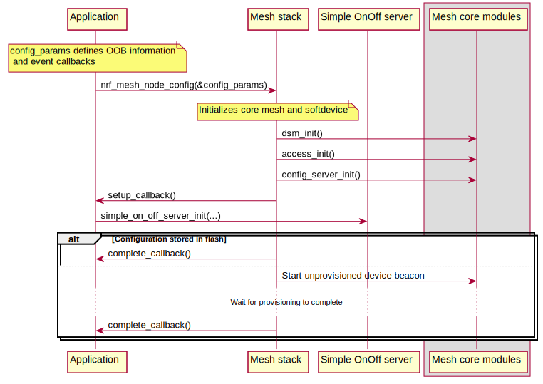
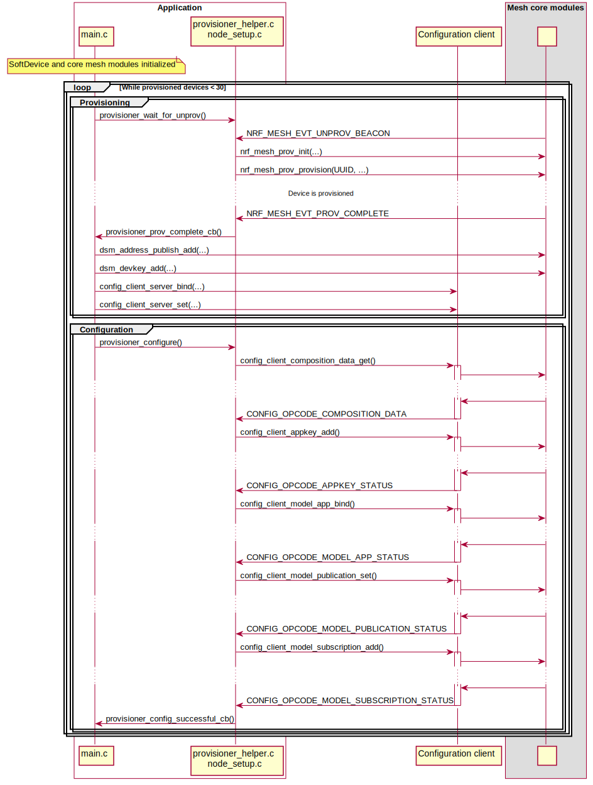

# Exploring Mesh APIs using light switch example

The light switch example is meant to showcase the APIs for the provisioner and provisionee roles
and how a simple Bluetooth Mesh network may be set up and configured. The network consists of one static
provisioner (that configures a network in a fixed predefined way), one light switch
(that implements a Simple OnOff client), and one or more light bulbs (that implement Simple OnOff servers).

#### Provisionee: light switch server

The server uses the following set of APIs:

1. [Initialization module](@ref MESH_STACK)
2. [Core mesh stack](@ref MESH_API_GROUP_CORE)
3. [Simple OnOff server model](@ref md_models_simple_on_off_README)

The initialization module implements the behavior of a provisionee device. It handles the
interface with the provisioning stack, setting up the configuration server, and restoring the device
state from flash.

As seen in `examples/light_switch/server/src/main.c`, the amount of code needed for the
application is minimal. It implements the following functionality:

1.  Setting basic configuration parameters, supported Out-Of-Bound (OOB) methods, clock configuration, callbacks,
    etc.
2.  Adding models and their event callbacks.

When the `provisioning_complete_cb()` callback is called, the device is provisioned and ready to be
configured by the provisioner. The following figure illustrates the setup with the relevant API calls:

#### Provisionee: Light switch client

The client uses the following set of APIs:

1.  [Initialization module](@ref MESH_STACK)
2.  [Core mesh stack](@ref MESH_API_GROUP_CORE)
3.  [Simple OnOff client](@ref md_models_simple_on_off_README)

The client application is implemented in a similar way as that of the server
(see `examples/light_switch/client/src/main.c`). Additionally, it has the following functionality:

1.  Handle button presses and call [Simple OnOff client APIs](@ref SIMPLE_ON_OFF_CLIENT) to send
mesh messages to the desired nodes or a group of nodes.
2.  Handle acknowledged message time-out and print a message in RTT log.

#### Provisioner: Setting up the network

The provisioner uses the following set of APIs:

1.  [Initialization module](@ref MESH_STACK)
2.  [Core mesh stack](@ref MESH_API_GROUP_CORE)
3.  [Provisioning](@ref MESH_API_GROUP_PROV)
4.  [Configuration client](@ref CONFIG_CLIENT)

In general, the provisioner role is an order of magnitude more complex than the provisionee role, both in
resource requirements and application complexity. Therefore, there is no simple "press play and it
works"-API for the provisioner. However, for a specific use case, it can be reduced into a set of
simple steps, as implemented in the provisioner example:

1.  Initialize:
    1.  Core mesh stack
    2.  Device state manager
    3.  Access layer
    4.  (Optional) Load flash configuration.
2.  Listen for unprovisioned beacons.
3.  Provision device.
4.  Configure device.
5.  If more devices should join the network, go back to step 2.

In the example code, this behavior is split between the following modules:

- `examples/light_switch/provisioner/src/main.c`: Deals with the initialization and setup of the mesh stack.
- `examples/light_switch/provisioner/src/provisioner_helper.c`: Deals with the provisioning process.
- `examples/light_switch/provisioner/src/node_setup.c`: Deals with the configuration process of the
node once the provisioning is completed.

The following figure shows the details of how provisioning and configuration are implemented with the provided APIs. Note that the
figure may simplify some API calls to provide a clearer understanding. See the relevant source
files for details.

