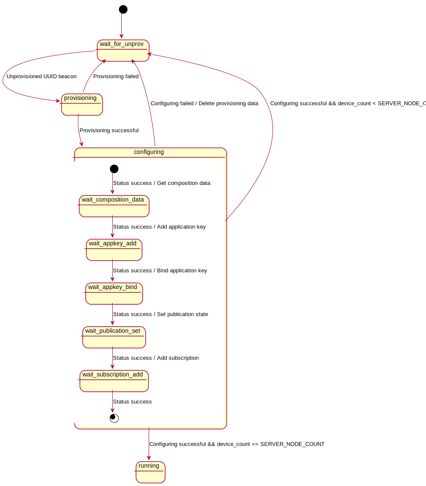
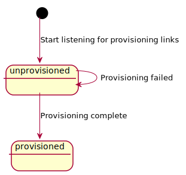

# Light switch demo

## Purpose

This demo project consists of four sub examples - The light switch server with and without GATT
proxy support, the light switch client and a provisioner example.

It demonstrates the mesh eco system containing devices acting in two roles, a Provisioner role, and
a Node role. In addition, it demonstrates how to use custom models by using
the custom [Simple OnOff model](@ref md_models_simple_on_off_README) in
a real application.

## Getting started

### Hardware requirements

See [compatiblity](@ref readme-compatibility) section for the supported boards.

- One development board for a client.
- One development board for the provisioner.
- One or more development boards for the servers.
  If you have more than thirty boards for the server, set `SERVER_NODE_COUNT` (in `light_switch_example_common.h`)
  to the number of boards available and rebuild the provisioner example.

### Running the demo

## Running the example

To build the examples, follow the instructions in
[Building the Mesh Stack](@ref md_doc_getting_started_how_to_build). Refer to the *How to run examples*
section in [Examples README](@ref md_examples_README) for the commands required to program a
device using `nrfjprog`.

1. Erase the device flash of your development board, and program the SoftDevice.
2. Flash the provisioner and client firmware on individual boards and the server firmware on other boards.
3. After a reset, press Button 1 on the provisioner to start the provisioning and configuration of the
   devices. The provisioner first provisions and configures the client and then moves on to provision and configure the servers, one by one.
4. Use the [RTT](@ref segger-rtt) viewer to view the RTT output generated by the provisioner.

The provisioner prints details about the provisioning and the configuration process in the RTT log.
When provisioner is scanning and provisioning a device, LED 1 on the Provisioner board is turned ON.
When configuration procedure is underway, LED 2 on the provisioner board is turned ON.

The provisioner configures Button 1 on the client board to control the first server, Button 2 to control
the second server, Button 3 to control the servers with Odd addresses, and Button 4 to control the
servers with Even addresses.

Once provisioning and configuration of the client node and at least one of the server nodes is completed,
you can press buttons on the client to see the LEDs getting toggled on the associated servers.

You can also press Button 1 on the first or second server to locally toggle the state of LED1 on them
and the same state will be reflected on the LED1 and LED2 of the client board.

If an RTT terminal is available and connected to the client, sending
the ASCII numbers `0`--`3` will have the same effect as pressing the buttons.

If any of the devices are powered off and back on, they will remember their configuration
in flash and rejoin the network. More information about the flash manager can be found
in the [flash manager documentation](@ref md_doc_libraries_flash_manager).

If provisioner encounters the error during the provisioning or configuration process for a certain node,
you can reset the provisioner to restart this process for that node.

## Details

### Mesh provisioner

The *provisoner* provisions and configures the nodes to setup a demo mesh network.
It is implemented as a multi-layered state machine due to the asynchronous nature of the provisioning and configuration process.

The provisioner first provisions and configures a client device with a known UUID.
After this it moves on to provision and configure the server devices.

The following diagram shows the typical state transitions of the provisioner while provisioning and configuring light switch servers.

For more information on how a provisioner works, see the [Mesh provisioning Guide](@ref md_doc_getting_started_provisioning).

### Light switch client

The *Light switch client* has a provisionee role in the network.
The client has four buttons to control state of the LED1 on servers.
It instantiates four instances of simple OnOff Client model.
The provisioner configures this client model instances to communicate with
servers.

### Light switch server

The *Light switch server* has a provisionee role in the network. It instantiates one instance
of the simple OnOff server model to control state of the LED1.

### Light switch server (with Proxy server)

The proxy server example application has the same behavior as the light switch server, but
additionally has the proxy role enabled. As proxy is only supported on the nRF52, cmake will not
generate the proxy server example for nRF51.

The proxy server application can either be provisioned and configured by the provisioner device
like the light switch server, or by a GATT-based provisioner. After provisioning, the proxy server
application starts advertising a connectable proxy beacon, which can be connected to by a proxy
client to interact with the mesh. The proxy client acts like any other mesh device, but sends all
its mesh communication over a BLE connection to a proxy server, which relays it into the mesh.

### Simple OnOff client/server model

The Simple OnOff Client/Server is a simple proprietary model for manipulating an
on/off state. Note that when the server has a publish address set (as in this example),
the server will publish any operation of its state to its publish address.

More information about the Simple OnOff model can be found in the
[Simple OnOff model README](@ref md_models_simple_on_off_README)
and in [Creating new models](@ref md_doc_getting_started_how_to_models).

## Mesh SDK APIs

See the @subpage md_doc_getting_started_how_to_build_your_network
document to get a quick overview of the various SDK APIs.

